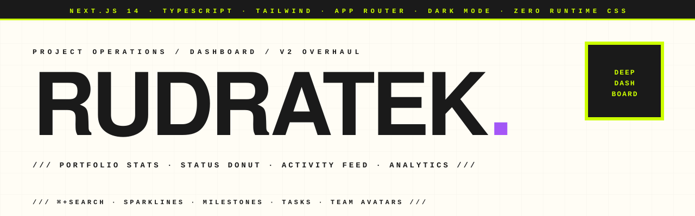

<p align="center">
  <picture>
    <source media="(prefers-color-scheme: dark)" srcset="assets-readme/hero-banner-dark.svg" />
    
  </picture>
</p>

<p align="center">
  <a href="https://github.com/hatimhtm/rudratek-dashboard/actions/workflows/ci.yml"></a>
  
  
  
  
</p>

<p align="center">
  <em>A premium project-operations dashboard. Twelve mock engagements, fully wired across a portfolio overview, status donut, activity feed, drillable side-panel with milestones / tasks / team / sparkline, analytics page with revenue trend + client concentration + at-risk signals, and a real responsive sidebar. ~2,000 LOC of TypeScript on Next.js 14 — no chart library, no UI kit, every viz is hand-rolled SVG.</em>
</p>

---

### `/// WHY V2`

V1 shipped as an interview deliverable: three flat stat cards on top of a project table, "minimalist luxury" framing, but rendering in **Arial** because a stray `font-family` in `globals.css` was overriding `next/font`. The accent token defined in `tailwind.config` (`luxury.accent: #d4af37`) was used nowhere. Net result: generic admin-dashboard look.

V2 is the actual product:

- **Real typography** — `next/font` finally takes effect. Inter for body, **Inter Tight** for display, **JetBrains Mono** for numbers and timestamps. Font features `ss01` / `cv11` enabled.
- **Single accent color, applied everywhere** — indigo `#6366F1` → violet `#A855F7` gradient. Used for: nav active state, sidebar logo, focus rings, stat-card icons, sparkline strokes, donut "active" segment, primary buttons.
- **Rich mock data** — every project has `progress`, `spent`, `priority`, `team[]`, `milestones[]`, `tasks[]`, `tags[]`, `revenueTrend[12]`, `lastActivityAt`. The dashboard actually has something to show.
- **Five hand-rolled viz primitives** — `Sparkline`, `ProgressBar`, `StatusDonut`, `BarChart`, `VerticalBarChart`. No Recharts, no Chart.js, no Tremor.
- **New Analytics page** — revenue trend bar chart, top-clients ranking, priority distribution, at-risk-project KPI.
- **Drillable side panel** — milestones with timeline rail, task checklist with completion ratio, team grid with role + initials avatars, project sparkline.
- **CI** — typecheck + lint + build on every push.

---

### `/// WHAT'S IN THE BOX`

```
┌──────────────────────────────────────────────────────────────────────┐
│ SIDEBAR (desktop) / BOTTOM NAV (mobile)                              │
│ ▸ Dashboard · Clients · Analytics · Settings                         │
│ ▸ Theme toggle persists across sessions                              │
├─────────────────────────┬────────────────────────────────────────────┤
│ DASHBOARD               │ ANALYTICS                                  │
│ ▸ 4 KPI cards + sparks  │ ▸ 4 KPI tiles (burn rate, avg progress…)   │
│ ▸ Status donut          │ ▸ Revenue trend bar chart                  │
│ ▸ Recent activity feed  │ ▸ Top clients (horizontal bars)            │
│ ▸ Filter + sort + table │ ▸ Priority distribution                    │
├─────────────────────────┴────────────────────────────────────────────┤
│ PROJECT DETAIL PANEL                                                 │
│ ▸ Status · priority · tags                                           │
│ ▸ Progress + budget/spent + 12-mo sparkline                          │
│ ▸ Team grid (avatars + roles)                                        │
│ ▸ Milestones timeline rail · tasks checklist                         │
└──────────────────────────────────────────────────────────────────────┘
```

| | |
|---|---|
| **Stat cards with sparklines** | Each KPI has a 12-point trend line. Sparkline is a 40-line SVG component — no chart lib. |
| **Status donut** | Hand-rolled SVG donut with three segments (Active / On Hold / Completed). Centre shows total count. |
| **Activity feed** | Reads from `data/activity.json` — typed events (milestone / task / comment / status), relative timestamps, type-coloured glyphs. |
| **Filters + sort** | Debounced search across name / client / tags. Multi-select status filter. Sort by recent / progress / budget / name. |
| **Project list** | Desktop table with progress bar + avatar stack + last-activity timestamp. Mobile cards collapse to single-column with the same data hierarchy. |
| **Project detail** | Side panel with backdrop blur, Esc-closes, focus-trapped scroll. Timeline rail, task ratio chip, sparkline of the project's revenue trend. |
| **Analytics page** | Top clients ranking, priority distribution, vertical bar chart for 12-month revenue, "at-risk" KPI (Critical + < 60% progress). |
| **Dark mode** | Token-driven (CSS vars per scheme). Persistent across reloads. No FOUC on first paint. |
| **Mobile-first** | Sidebar collapses to a bottom nav with theme toggle below 768px. Tables collapse to cards. Active touch targets > 44px. |

---

### `/// STACK`

```
NEXT.JS 14         App Router · server-rendered pages · client islands
TYPESCRIPT 5       strict — every prop typed, no implicit any
TAILWIND 3.4       RGB-channel CSS variables for token-driven theming
LUCIDE             icon system, tree-shaken
FRAMER MOTION      held in deps for future micro-interactions; current
                   animations are pure CSS keyframes
ZERO CHART LIBS    Sparkline / BarChart / Donut / ProgressBar — hand-rolled
```

---

### `/// LOCAL DEV`

```bash
git clone https://github.com/hatimhtm/rudratek-dashboard.git
cd rudratek-dashboard
npm install
npm run dev        # http://localhost:3000
npm run build      # production bundle
npm run lint       # next lint
npx tsc --noEmit   # typecheck
```

Requires **Node 18+**. The project ships with mock data (`src/data/projects.json` + `activity.json`) — no API or database needed.

**Deploy**: one-click on Vercel, Netlify, or any platform that runs Next.js 14. Static-ish — only server components are used, no per-request work.

---

### `/// PROJECT LAYOUT`

```
rudratek-dashboard/
├── src/
│   ├── app/
│   │   ├── page.tsx              Dashboard (KPIs, donut, activity, list)
│   │   ├── clients/              Per-client portfolio summaries
│   │   ├── analytics/            Revenue trend · top clients · priority mix
│   │   ├── settings/             Profile · preferences · notifications
│   │   ├── layout.tsx            Fonts + ThemeProvider + Sidebar shell
│   │   └── globals.css           Token system (light + dark scopes)
│   ├── components/
│   │   ├── ui/                   Avatar · Sparkline · ProgressBar
│   │   │                          BarChart · PriorityChip
│   │   ├── StatsCard.tsx
│   │   ├── StatusDonut.tsx
│   │   ├── ActivityFeed.tsx
│   │   ├── ProjectList.tsx       Filtering + sorting orchestrator
│   │   ├── ProjectCard.tsx       Desktop row + mobile card
│   │   ├── ProjectDetail.tsx     Side-panel drill-in
│   │   ├── Filters.tsx           Search · status · sort
│   │   ├── Sidebar.tsx           Desktop nav + mobile bottom nav
│   │   ├── StatusBadge.tsx
│   │   └── EmptyState.tsx
│   ├── contexts/                 ThemeContext (light / dark)
│   ├── data/                     projects.json · activity.json
│   ├── hooks/                    useDebounce
│   ├── types/                    Project, TeamMember, Milestone, Task…
│   └── utils/                    cn, format (currency + date)
├── tailwind.config.ts            Token shape — RGB channels + alpha
├── .github/workflows/ci.yml      Lint · typecheck · build
└── assets-readme/                Brutalist banner SVGs (light + dark)
```

---

### `/// V2 CHANGELOG`

- **Typography** — fixed an Arial-overriding `font-family` rule in `globals.css`, paired Inter / Inter Tight / JetBrains Mono via `next/font`.
- **Tokens** — switched Tailwind config to RGB-channel CSS variables (`rgb(var(--accent) / <alpha-value>)`), enabling alpha-channel theming via a single token swap.
- **Accent** — replaced the unused-gold token with an indigo→violet gradient, applied to every focal point.
- **Data model** — expanded `Project` from 7 fields to 14, added `TeamMember`, `Milestone`, `Task`, `ActivityEntry` types.
- **Mock data** — 12 projects with realistic team rosters, milestone timelines, task lists, and 12-month revenue trends.
- **Five new viz primitives** — Sparkline, ProgressBar, BarChart, VerticalBarChart, StatusDonut. All under 60 LOC each, zero deps.
- **Dashboard** — 3 KPI cards → 4 KPI cards with sparklines; added Status donut + Recent activity feed.
- **Project list** — added progress column, team avatar stack, last-activity timestamp; sort by recent / progress / budget / name.
- **Project detail** — milestones timeline, tasks checklist, team grid with role + initials, revenue sparkline.
- **New Analytics page** — burn-rate KPI, average-progress KPI, at-risk-project KPI, revenue trend chart, top-clients ranking, priority distribution.
- **Sidebar** — gradient logo mark, eyebrow label, accent-soft active state with a 0.5px rail.
- **CI** — typecheck + lint + build on every push (`.github/workflows/ci.yml`).

---

### `/// LICENSE`

MIT — drop the code into any project, swap the mock data for a real API, rebrand the sidebar logo. Just keep the copyright line.

---

<p align="center">
  <a href="https://hatimelhassak.is-a.dev"></a>
  <a href="https://cal.com/hatimelhassak/engineering-discovery"></a>
  <a href="https://www.linkedin.com/in/hatim-elhassak/"></a>
  <a href="mailto:hatimelhassak.official@gmail.com"></a>
</p>

<p align="center">
  <code>///&nbsp;&nbsp;OPEN FOR NEW WORK&nbsp;&nbsp;///&nbsp;&nbsp;CONTRACT &amp; FREELANCE&nbsp;&nbsp;///&nbsp;&nbsp;REMOTE WORLDWIDE&nbsp;&nbsp;///</code>
</p>
